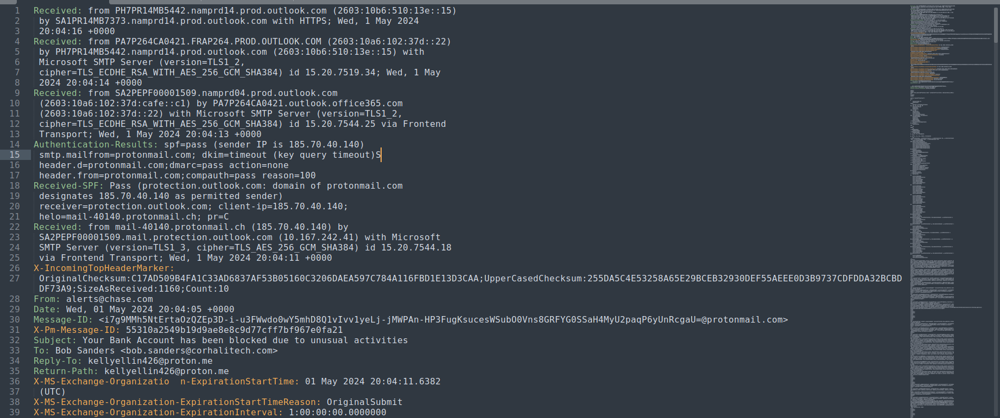
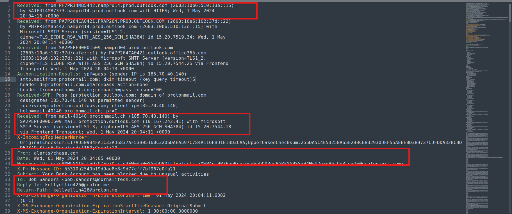

# 📧 Email Header Analysis

*Part of the [Phishing Analysis](../) section — [SOC Lab Portfolio](https://github.com/Anzar-Ahmed/SOC-Lab-Portfolio)*

---

## 🎯 Objective
To analyze raw email headers from suspicious/phishing samples using a text editor (Sublime Text) to identify sender spoofing, authentication mismatches (SPF/DKIM/DMARC), and Reply-To/Return-Path inconsistencies — without relying on automated header-analysis tools, in order to build strong manual analysis fundamentals.

## 🧰 Tools Used
* **Sublime Text:** For viewing, manual parsing, and tracing raw `.eml` header sources (Received chain, Authentication-Results, Reply-To, and Return-Path fields).

---

## 📊 Summary — Emails Analyzed

| # | Subject | Claimed Sender | SPF/DKIM/DMARC | Verdict | Key Red Flag |
|---|---|---|---|---|---|
| 1 | Your Bank Account has been blocked due to unusual activities | alerts@chase.com | SPF: Pass* / DKIM: Timeout / DMARC: Pass* | 🔴 Malicious | Reply-To & Return-Path point to an unrelated ProtonMail address, not Chase |
| 2 | *(pending)* | | | | |

> \* **Note on SPF/DMARC:** The "Pass" status is deceptive. It authenticates `protonmail.com` (the envelope sender), not the claimed `chase.com` domain visible to the user.

---

### Sample #1 — "Your Bank Account has been blocked due to unusual activities"

**Scenario:** Email impersonating Chase Bank, using urgency-based social engineering ("account blocked due to unusual activity") to pressure the recipient into taking action — a classic bank-alert phishing lure.

**Action Taken:**
Opened the raw email header source in Sublime Text and manually analyzed the `Received` chain, `Authentication-Results`, `Reply-To`, and `Return-Path` fields to verify if the visible sender identity aligned with the actual sending infrastructure.

**Main Finding (Phishing Indicators Identified):**
* **Display vs Header Mismatch:** The visible **`From: alerts@chase.com`** header impersonates Chase Bank, but the **`Reply-To`** and **`Return-Path`** fields both point to an attacker-controlled address: `kellyellin426@proton.me`.
* **Infrastructure Trace:** The `Received` chain maps back to **`mail-40140.protonmail.ch (185.70.40.140)`**, proving the email originated from ProtonMail's mail servers, not Chase/JPMorgan Chase infrastructure.
* **Deceptive Authentication (DMARC/SPF Pass):** `Authentication-Results` shows `spf=pass` and `dmarc=pass`. However, granular inspection reveals `smtp.mailfrom=protonmail.com` and `header.d=protonmail.com`. The checks passed only because the attacker used a legitimate ProtonMail account to send the email—no validation was performed for `chase.com`.
* **DKIM Failure:** The DKIM check returned `timeout (key query timeout)`, meaning no valid signature was verified for the actual sending domain.

**Analysis Verdict:** 🔴 **Confirmed Phishing** — Friendly-From spoofing of Chase Bank via ProtonMail infrastructure, with alternative routing headers (`Reply-To`/`Return-Path`) configured to harvest responses.

**Analyst Recommendations (SOC Playbook):** 
In an enterprise environment, immediate remediation steps would include:
1. Blocking the sending IP (`185.70.40.140`) and the external threat actor email (`kellyellin426@proton.me`) at the secure email gateway (SEG).
2. Running a tenant-wide search/purge query to look for matching delivery patterns across all user mailboxes.
3. Checking proxy logs for any outbound traffic to external links if the email contained a payload or URL.

---

### 📸 Evidence & Verification

To validate the manual analysis findings, the following structural logs and external OSINT source verifications were compiled as part of the investigation:

#### 🧾 Raw Header Analysis (Sublime Text)
The screenshot below shows the initial raw ingestion of the `.eml` file within the text editor, showcasing the full unparsed text block prior to tracing.

---

#### 🔍 Highlighted Key Findings & Discrepancies
This annotated view isolates the critical insertion points of the malicious headers—specifically highlighting the **Friendly-From** impersonation (`alerts@chase.com`) vs. the actual routing indicators (`Reply-To` and `Return-Path` mapping back to ProtonMail).

---

#### 🌐 External OSINT Verification

**MXToolbox (Header Analysis & IP Reputation Check)**
The header source was cross-verified through MXToolbox to validate the sending infrastructure's reputation and analyze the delivery hops. The results confirmed that the relaying IP does not belong to the authorized Chase Bank network blocks.

**WHOIS Lookup (Domain Security Profile)**
A WHOIS look-up was executed against the unauthorized infrastructure IP (`185.70.40.140`) to document the ASN ownership and infrastructure history, verifying its explicit association with ProtonMail's Switzerland-based assets.

---

## 🚩 IOC Findings

| Indicator | Type | Description |
|---|---|---|
| `alerts@chase.com` | Spoofed Display Sender | Forged "From" address impersonating Chase Bank |
| `kellyellin426@proton.me` | Reply-To / Return-Path | Actual attacker-controlled mailbox behind the spoofed display name |
| `185.70.40.140` | Sending IP | ProtonMail infrastructure IP (`mail-40140.protonmail.ch`) used to relay the phishing email |
| `protonmail.com` | Authenticated Envelope Domain | Domain actually validated by SPF/DMARC — mismatched against the claimed `chase.com` sender |

---

## 🗺️ MITRE ATT&CK Mapping

| Technique ID | Technique Name | Observed Activity |
|---|---|---|
| [T1566.002](https://attack.mitre.org/techniques/T1566/002/) | Phishing: Spearphishing Link | Bank-alert lure designed to drive victim to a malicious link/action |
| [T1036.005](https://attack.mitre.org/techniques/T1036/005/) | Masquerading: Match Legitimate Name or Location | "From" display forged to impersonate Chase Bank |

---

## ✅ Conclusion
*(Update once all 5 samples are complete — summarize the common patterns observed across samples: e.g. how many relied on Friendly-From spoofing vs. compromised legitimate accounts, most common authentication failure type, etc.)*

## 💡 Key Learning
* **"SPF: Pass" does not guarantee sender legitimacy** — It only validates the envelope sender domain (`smtp.mailfrom`), which can easily be different from the spoofed `From` address a user actually sees in their mail client. Always verify domain alignment.
* **Reply-To and Return-Path verification** are highly reliable indicators for spotting Friendly-From spoofing quickly without over-reliance on external parsing automation.
* Analyzing headers manually builds technical muscle memory for identifying edge-case header anomalies that automated security controls or parsers might occasionally gloss over.

---

### 📂 Navigate

[⬅️ Back to Phishing Analysis Overview](../) &nbsp;|&nbsp; [Email Content Analysis ➡️](../02-Email-Content-Analysis)

